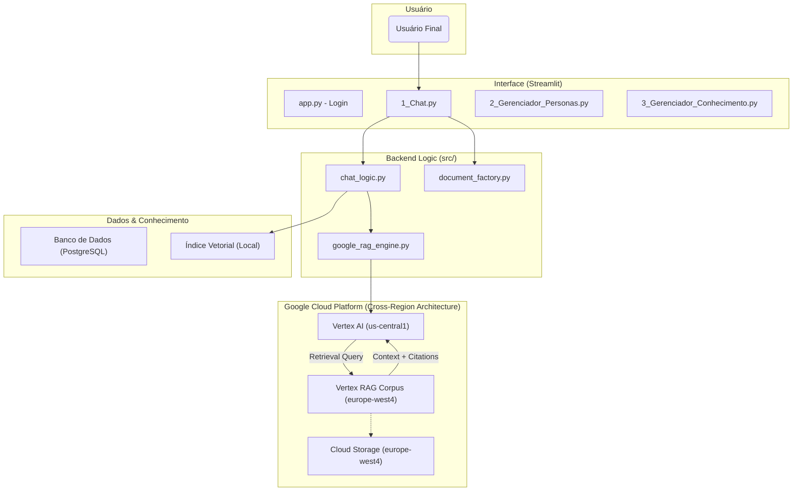

# Arquitetura do Sistema DiamondOne (BinahSys)

Este documento descreve a arquitetura de alto nível da plataforma, seus principais componentes e como eles interagem.

---

## Diagrama de Componentes

O diagrama abaixo ilustra a interação entre a interface do usuário, a lógica de backend, a base de dados e as APIs externas.

## Arquitetura de RAG Híbrida (Local & Nuvem)

O sistema implementa uma estratégia híbrida de Recuperação Aumentada por Geração (RAG):

1.  **Modo Local (FAISS):**
    *   Ideal para desenvolvimento rápido e testes locais.
    *   Usa `langchain` e `faiss-cpu` para indexar documentos na máquina onde o app roda.
    *   Limitação: Não persiste dados se o container reiniciar (ex: Streamlit Cloud).

2.  **Modo Nuvem (Google Vertex AI):**
    *   Ideal para produção e grandes volumes de dados.
    *   **Arquitetura "Split-Brain" (Cross-Region):**
        *   **DADOS (Corpus):** Armazenados na região `europe-west4` (Holanda) para compliance ou localidade de dados.
        *   **CÉREBRO (LLM):** O cliente se conecta à região `us-central1` (EUA) para acessar os modelos Gemini mais recentes (2.0 Flash/Pro), que podem não estar disponíveis em todas as regiões da Europa.
        *   O Vertex AI gerencia a conexão transparente entre o modelo nos EUA e o índice vetorial na Europa.

## Fluxo de Decisão de RAG

A função `get_rag_chain` decide qual motor usar com base na Persona:

*   **SE** a Persona tem um `google_corpus_id` definido:
    *   Ativa o `google_rag_engine`.
    *   Ignora o índice local.
    *   Retorna citações com links para o Google Cloud Storage.
*   **SENÃO**:
    *   Ativa o fluxo LangChain/FAISS.
    *   Usa documentos locais.

## Descrição dos Componentes

- **Interface (Streamlit):** Camada de apresentação. Agora inclui "Modo Desenvolvedor" para observabilidade.
- **google_rag_engine.py:** Módulo responsável pela comunicação com a Vertex AI, autenticação via Service Account e extração robusta de citações (parsing de objetos complexos).
- **document_factory.py:** Módulo utilitário para converter conversas e respostas Markdown em documentos Word (`.docx`) para download.
